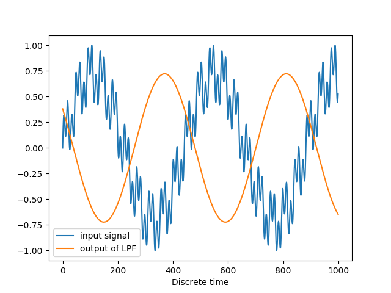

FIR example
===========

Finite impulese response system is used as filter and tested on synthetic sound. If you run script in this directory it will execute function which will create low-pass filter with cut-off frequency set by default at 500Hz. Then, it will generate synthetic sound which consists of three different sine waves (100Hz, 1000Hz and 3000Hz). Both, generated input and filter coefficients will pass through Quantizer which prepare signals for real hardware (quantizes them to fix-point representation). Here is wrapper function call for this example:

.. data:: synthetic example definition
   .. code-block:: python
      example_synthetic(sample_rate_hz=44100,
                        nsamples=1000,
                        input_freqs_hz=[100, 1000, 3000],
                        transition_width=1 / 50,
                        ripple_db=60.0,
                        cutoff_hz=500.0,
                        fix_format=(16, 15),
                        cosim=True):

As it can be seen, to play with example you can change sample rate, cut off frequency, 3 different input frequencies specified by input_freqs_hz argument, etc.

After preparation, input signal is saved as .wav file named *synthetic_test_input.wav* and pass to hardware simulator. At the end, hardware output is saved as .wav file in file named *synthetic_test_output.wav*.

To hear difference between input and output signals just play created .wav files. In *synthetic_test_input.wav* you should hear all three frequencies unlike in *synthetic_test_output.wav* where you should hear only lowest one. If you are more visual person see image below which visualize input and output of filter.

**NOTE**: To hear something meanful run function with at least 5000 samples (duration > 0.1s) which will create sound long enough to be captured by human.

